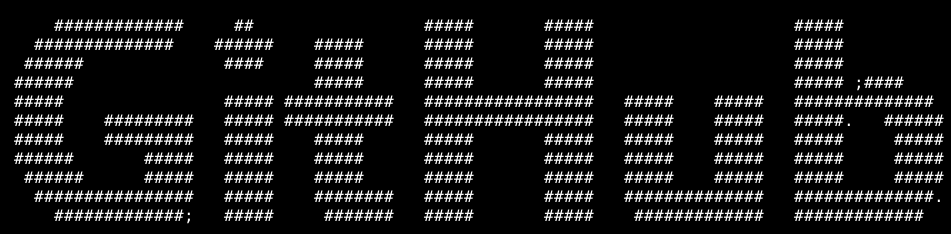
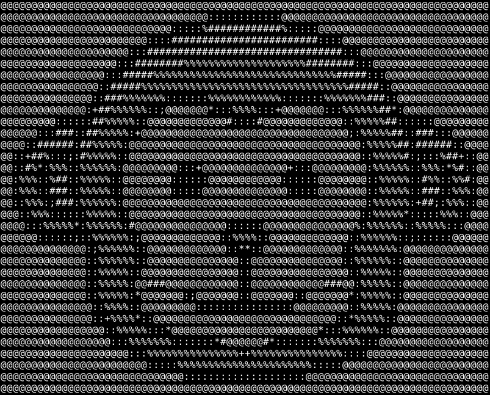

# ASCIIrefrigerator
Image to ASCII generator.

---
## Examples
This generator works best with higher contrast images.

[GitHub's press logo](examples/github.bmp):

```
./asciirefrigerator github.bmp -w 99 -h 15 --invert
```

[Monkey face](https://search.creativecommons.org/photos/bbe546b8-f289-464d-aea7-8d9c157151d0) (by [webalys](https://twitter.com/webalys)):

```
./asciirefrigerator monkey.bmp -w 80 -h 34
```

---

## Version
Current version: **2020.09.1**

*The version format is &quot;&lt;year&gt;.&lt;zero padded month&gt;.&lt;revision number&gt;&quot;.*

---

## License
[MIT License](LICENSE.md)

---

## Usage
```
./asciirefrigerator --help
./asciirefrigerator --version
./asciirefrigerator <bmp input file> [options]
```

### Options
```
--output-file <output file name>
--width <output width>
--height <output height>
--resize-method <resize method name (nearest-neightbor, or bilinear)>
--character-space <character space name (gradient9, or bw)>
--custom-character-space <character space string>
--invert
```

---

## Building
This generator uses the [Boost library](https://www.boost.org/), version 1.74.0 (earlier versions might be compatible), for the handling of images, and the program options, so it must be installed for the compilation.

---

## Limitations
This generator only works properly for non-indexed colors BMP files.

---

## Notes
This generator was created for educational purposes only.